# Cura-Postprocessing-Scripts
Compilation of personnal Ultimaker Cura postprocessing scripts

Installation
--

The files must be stored in the user script directory of the respective Cura version: **\AppData\Roaming\cura<version>\scripts**

After the next start of Cura the script can be added via Extension / Post-Processing / Modify G-Code Add a script.

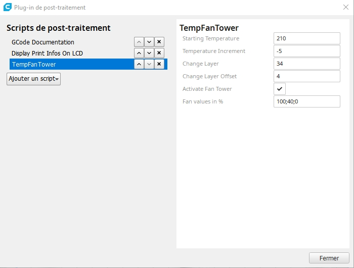

DisplayPrintInfosOnLCD.py
-----

Description:  This plugin shows custom messages about your print on the Printer Panel...
              Please look at the option
               - LayerId: Use the Layer ID coded in the Gcode and not an increment starting from 0
               
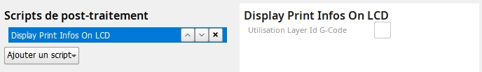

GCodeDocumentation.py
-----
Description: Add slicing paramter in the GCode Header

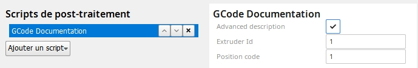

SpeedTower.py
-----
Description:  postprocessing-script to easily define a Speed Tower.

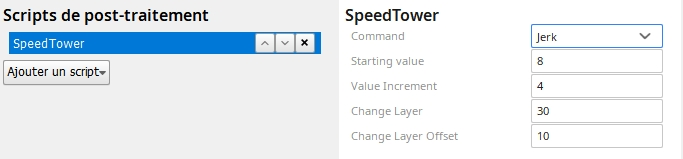

TempFanTower.py
-----

Description:  postprocessing-script to easily use an temptower and not use 10 changeAtZ-scripts

 The default values are for this temptower PLA model [https://www.thingiverse.com/thing:2493504](https://www.thingiverse.com/thing:2493504)
- Temp Tower PLA de 210 à 170
- Possibility to define also a Fan Tower , Fan percentage speed indicate with semi-colon as seprator

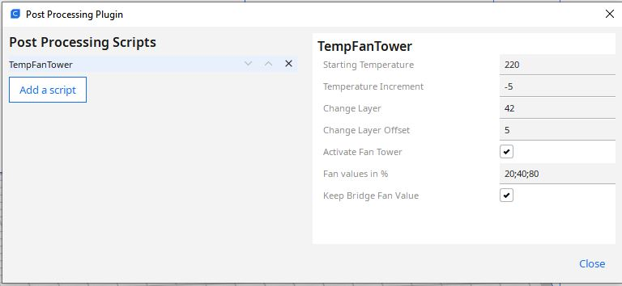

RetractTower.py
-----

Description:  postprocessing-script to easily create a Retract Tower

Two options :

    - Speed   :  Speed variation
	
    - Retract :  Distance retract variation

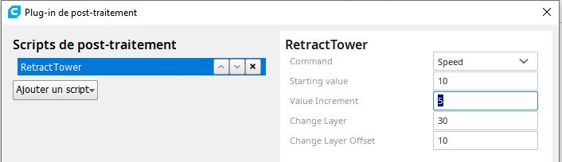

ZMoveIroning.py
-----

Description: ZMoveIroning for 3D prints. Z hop for ironing

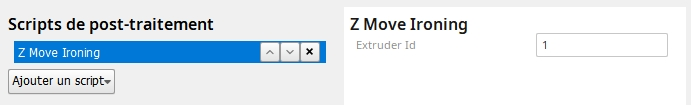

RepRapPrintInfos.py
-----

Description: add header infos and part thumbnail for RepRap machine 3DWOX  

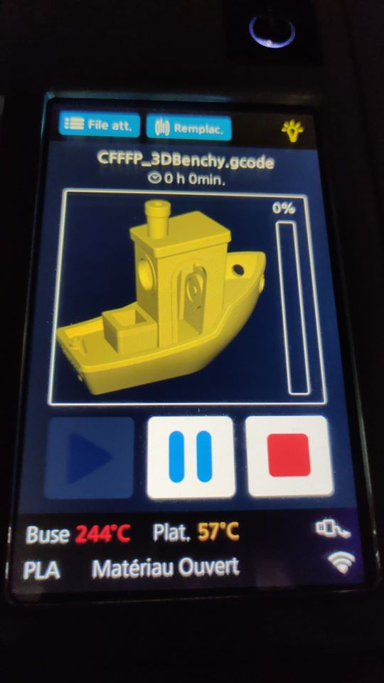

**Not fuly tested**

GradientInfill.py (Cura postprocessor PlugIn script)
-----

**Version : 1.5**

GradientInfill.py Posprocessing Script for Cura PlugIn. Save the file in the _C:\Program Files\Ultimaker Cura **X.X**\plugins\PostProcessingPlugin\scripts_ directory.

Extrusion mode in Cura must be set in relative mode. If it's not the case an error message will be raised in Cura.

No Gcode will be generated by Cura in this case. Same behaviour if Cura settings are not suitable for Gradient Infill modification :

- Infill pattern type ZigZag , Concentric , Cross and Cross3D not allowed  
- In cura the option "Connect Infill Lines" for the other patterns musn't be used.

The wall must be done before the Infill element. So In Cura the Option infill_before_walls must be set to Off

Postprocessing Options
-

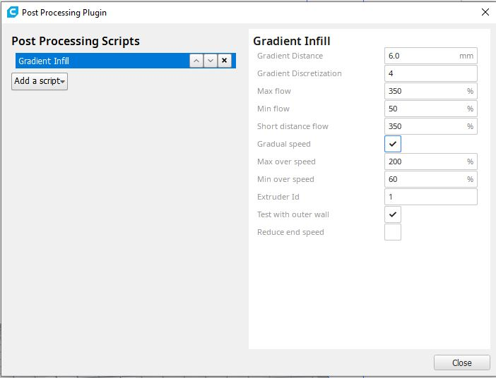

- Gradient Distance :  Distance of the gradient (max to min) in mm
- Gradient Discretization : Only applicable for linear infills; number of segments within the gradient(segmentLength=gradientThickness / gradientDiscretization) use sensible values to not overload
- Max flow : Maximum extrusion flow
- Min flow : Minimum extrusion flow
- Short distance flow : Extrusion flow for short distance < 2x Gradient distance
- Gradual speed : Activate also Gradual Speed linked to the gradual flow
- Max over speed : Maximum over speed factor
- Min over speed : Minimum over speed factor
- Extruder Id : Define extruder Id in case of multi extruders
- Test with outer wall : "Test the gradiant with the outer wall segments

A new Flow Value for short distance (Linear move < 2 x Gradient distance) added to the standard GradientInfill script.

Add a gradual speed variation for machine without direct drive extruder.

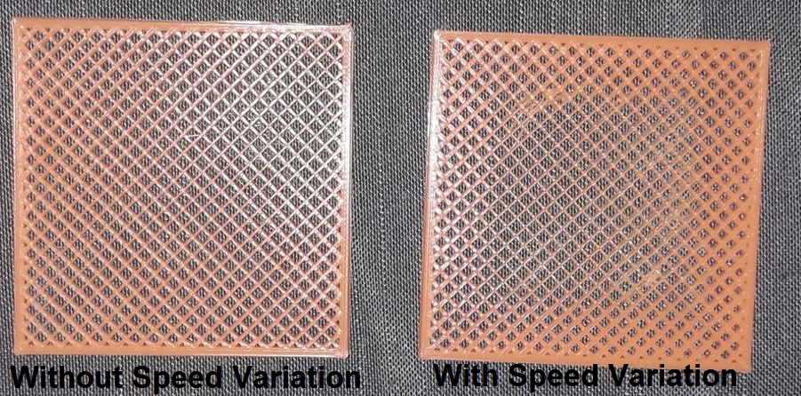

Sample part with a Gradient distance set to 8 mm :
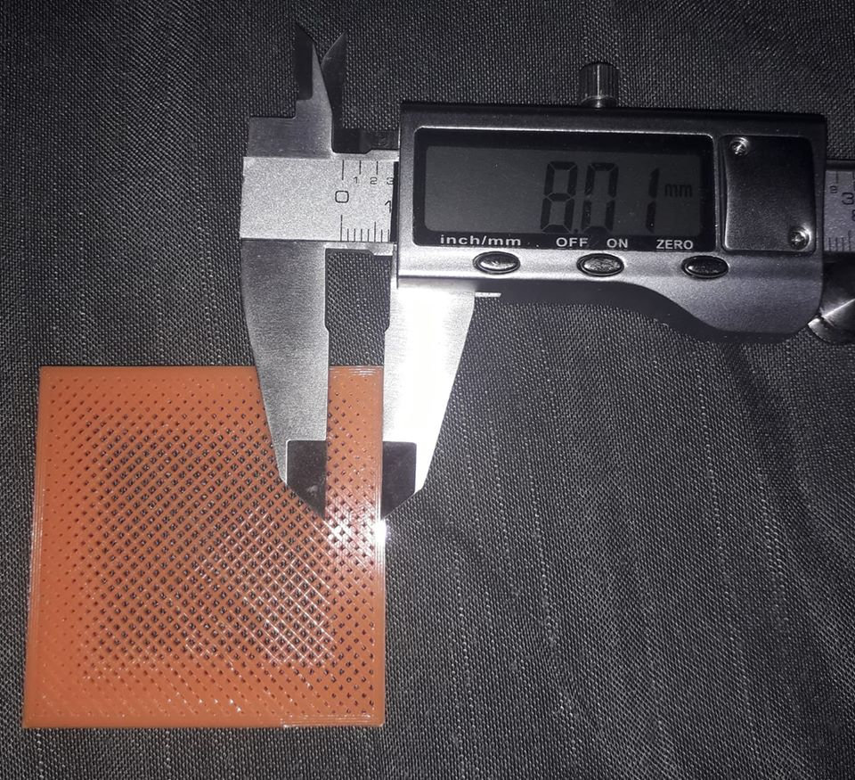

CommentGCode.py
----

This Cura Postprocessing Script adds comments to the G-Code. The user can select or deselect comments for M-Commands and G-Commands separately.

G0 and G1 commands are only commented if a retract is included.

Command, description and parameters are read from a CSV file. If a command is not contained, the required data is determined once via the website http://marlinfw.org/docs/gcode/ and added to the CSV file.

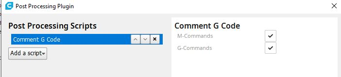

