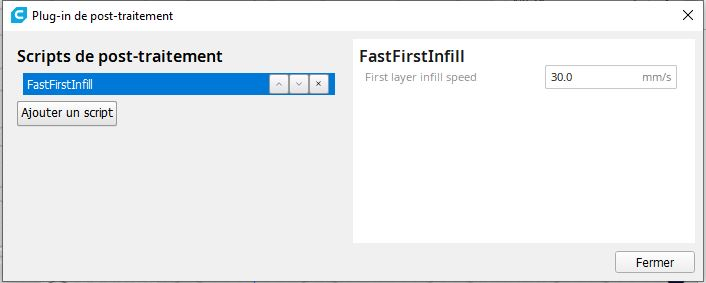
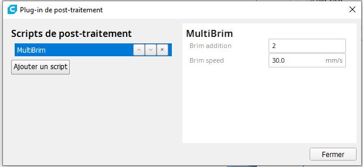
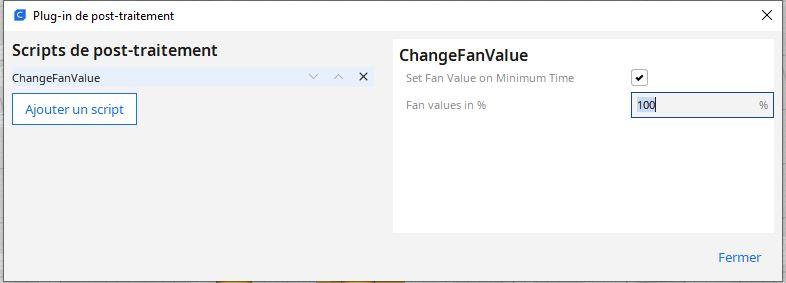
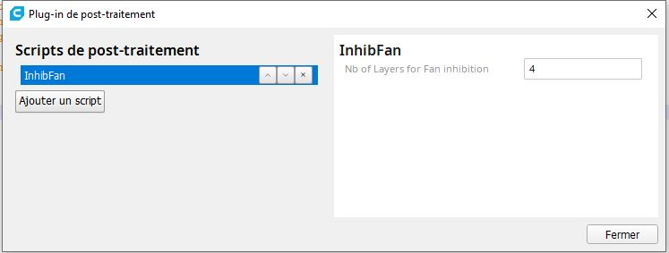

# Cura-Postprocessing-Scripts
Compilation of personnal Ultimaker Cura postprocessing scripts

Installation
--

The files must be stored in the user script directory of the respective Cura version: **\AppData\Roaming\cura<version>\scripts**

After the next start of Cura the script can be added via Extension / Post-Processing / Modify G-Code Add a script.

[DisplayPrintInfosOnLCD.py](DisplayPrintInfosOnLCD.py)
-----

Description:  This plugin shows custom messages about your print on the Printer Panel...
              Please look at the option
               - LayerId: Use the Layer ID coded in the Gcode and not an increment starting from 0
               

[GCodeDocumentation.py](GCodeDocumentation.py)
-----
Description: Add slicing parameter in the GCode Header

[SpeedTower.py](SpeedTower.py)
-----
Description:  postprocessing-script to easily define a Speed Tower.

 This script offer the possibilities to modify :
- Speed ( By using  M220 instruction ) 
- Acceleration
- Jerk
- Junction Deviation
- Marlin Linear Advance
- RepRap Pressure Advance

[TempFanTower.py](TempFanTower.py)
-----

Description:  postprocessing-script to easily use an temptower and not use 10 changeAtZ-scripts

 The default values are for this temptower PLA model [https://www.thingiverse.com/thing:2493504](https://www.thingiverse.com/thing:2493504)
- Temp Tower PLA de 210 à 170
- Possibility to define also a Fan Tower , Fan percentage speed indicate with semi-colon as seprator

[RetractTower.py](RetractTower.py)
-----

Description:  postprocessing-script to easily create a Retract Tower

Two options :

    - Speed   :  Speed variation
	
    - Retract :  Distance retract variation

[FanIroning.py](FanIroning.py)
-----

Description: FlowIroning for 3D prints. Change the Fan value on ironing operation.

Note : Some Ironing area are not detected by the script. It is mainly the small areas located on contour areas.

[RepRapPrintInfos.py](RepRapPrintInfos.py)
-----

Description: add header infos and part thumbnail for RepRap machine 3DWOX  

**Not fuly tested**

[GradientInfill.py](GradientInfill.py) (original idea from [CNCKitchen](https://github.com/CNCKitchen/GradientInfill) )
-----

**Version : 1.5**

GradientInfill.py Posprocessing Script for Cura PlugIn. Save the file in the _C:\Program Files\Ultimaker Cura **X.X**\plugins\PostProcessingPlugin\scripts_ directory.

Extrusion mode in Cura must be set in relative mode. If it's not the case an error message will be raised in Cura.

No Gcode will be generated by Cura in this case. Same behaviour if Cura settings are not suitable for Gradient Infill modification :

- Infill pattern type ZigZag , Concentric , Cross and Cross3D not allowed  
- In cura the option "Connect Infill Lines" for the other patterns musn't be used.

The wall must be done before the Infill element. So In Cura the Option infill_before_walls must be set to Off

**Postprocessing Options**

- Gradient Distance :  Distance of the gradient (max to min) in mm
- Gradient Discretization : Only applicable for linear infills; number of segments within the gradient(segmentLength=gradientThickness / gradientDiscretization) use sensible values to not overload
- Max flow : Maximum extrusion flow
- Min flow : Minimum extrusion flow
- Short distance flow : Extrusion flow for short distance < 2x Gradient distance
- Gradual speed : Activate also Gradual Speed linked to the gradual flow
- Max over speed : Maximum over speed factor
- Min over speed : Minimum over speed factor
- Extruder Id : Define extruder Id in case of multi extruders
- Test with outer wall : "Test the gradiant with the outer wall segments

A new Flow Value for short distance (Linear move < 2 x Gradient distance) added to the standard GradientInfill script.

Add a gradual speed variation for machine without direct drive extruder.

Sample part with a Gradient distance set to 8 mm :

[CommentGCode.py](CommentGCode.py)
----

This Cura Postprocessing Script adds comments to the G-Code. The user can select or deselect comments for M-Commands and G-Commands separately.

G0 and G1 commands are only commented if a retract is included.

Command, description and parameters are read from a CSV file. If a command is not contained, the required data is determined once via the website http://marlinfw.org/docs/gcode/ and added to the CSV file.

[InsertAtLayerChange.py](InsertAtLayerChange.py)
----

Modification of the official script with Layer Increment.
	
[InsertAtLayerNumber.py](InsertAtLayerNumber.py)
----

Insert a Gcode at Layer Number.  Can be insert Before or after the Layer Number.

[FastFirstInfill.py](FastFirstInfill.py)
----

Script cura to set a higher filling speed for the first layer.

	
Original first layer speed before modification
	
	

First layer speed after modification with the script.
	
	

	
	
[SlowZ.py](SlowZ.py)
----

Script cura to reduce the speed according to the print height. 

	
	- Slow Z percentage : Positive value to slow the print as the z value rises up to this percentage.
	
	- Slow Z height : Positive value to define the start height of the speed reduction.
	
	- Display details on LCD : This setting will insert M117 gcode instructions, to display current modification in the G-Code is being used.

	

[MultiBrim.py](MultiBrim.py)
----

Script cura to duplicate the initial Brim/skirt to obtain a thick Brim. 

**Note :** Updated for Cura 5.0 & 5.1

	
	- Brim addition : Number of brim to add to the existing one.
	
	- Brim speed : Speed for the subsequent brims.
	
Multi layer brim height request on Cura Github [#6929](https://github.com/Ultimaker/Cura/issues/6929)
	
Different tests made with the current release (V1.6)

	
	
[ChangeFanValue.py](ChangeFanValue.py)
----

Script Cura to change the FAN value when we are in the case of Minimum Layer Time. When we are in minimum Layer Time situation the Script fix the FAN values to the **Fan value in %** 

	
Note : In GCode  100% = 255 for the Fan Value *M106S255*.

[InhibFan.py](InhibFan.py)
----

Script Cura to turn off the print cooling fan on the first X Layers.

	
Note : In GCode turn off the print cooling fan. [M107](https://marlinfw.org/docs/gcode/M107.html).

[ZMoveG0.py](ZMoveG0.py)
-----

Description: Z hop for every G0 displacement even if Retraction is not define ( Retraction must be desactivate) . Use the speed_z_hop and the retraction_hop as retraction parameter.

[ZMoveIroning.py](ZMoveIroning.py)
-----

Description: ZMoveIroning for 3D prints. Z hop for ironing

